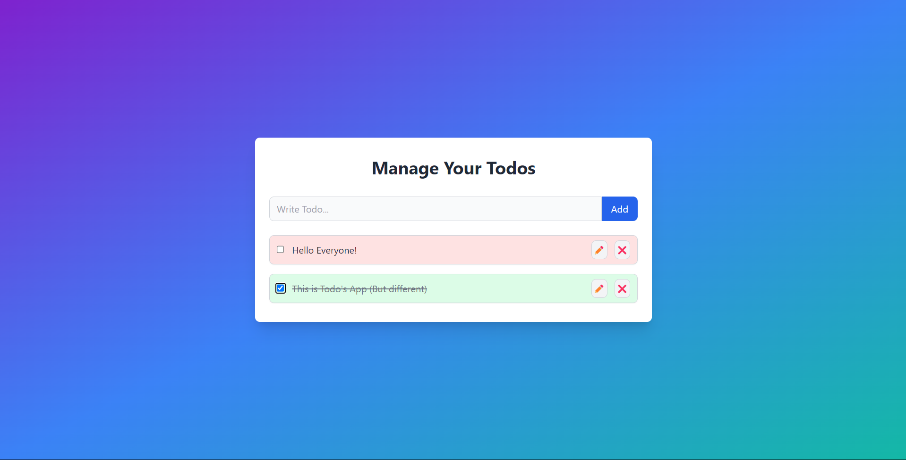

# Todo App with Enhanced UI and Animations

This is a responsive Todo app built with React, providing essential CRUD (Create, Read, Update, Delete) functionality for managing todos. The app features a modern, elegant UI with animations, making the user experience engaging and intuitive. It uses React context for state management and leverages TailwindCSS for styling.

## Features

- **Add Todos**: Quickly add new tasks to your todo list.
- **Edit Todos**: Edit existing tasks by toggling an editable text field.
- **Complete Todos**: Mark tasks as complete or incomplete with a checkbox.
- **Delete Todos**: Remove tasks that are no longer needed.
- **Animations**: Hover effects, transitions, and fade-in animations for a smooth, interactive experience.
- **Elegant UI Styling**: A calming color palette, smooth shadows, and rounded corners enhance the visual appeal.
- **Local Storage Persistence**: Keeps your todos saved in the browser even after refreshing.

## Download and Installation

### Download Options

1. **Clone the Repository**:

   ```bash
   git clone https://github.com/aadilkhan08/todo-app-enhanced.git
   ```
2. **Download Zip**:

   - Go to the [GitHub Repository](https://github.com/aadilkhan08/todo-app-enhanced).
   - Click on the green "Code" button and select "Download ZIP" to download the project as a zip file.

### Installation Steps

1. Navigate to the project directory:

   ```bash
   cd todo-app-enhanced
   ```
2. Install the dependencies:

   ```bash
   npm install
   ```
3. Start the development server:

   ```bash
   npm run dev
   ```
4. Open [http://localhost:](http://localhost:3000)5173 in your browser to view the app.

## Usage

1. **Adding a Todo**: Type a task in the input field and click the `Add` button.
2. **Editing a Todo**: Click the ✏️ icon to enable editing mode, modify the text, and click 📁 to save.
3. **Completing a Todo**: Mark a task as completed by clicking the checkbox. This will strike through the text and change its background color.
4. **Deleting a Todo**: Click the ❌ icon to remove a task.

## Key Components

### `App.jsx`

- **Todo Management**: Manages the list of todos with functions for adding, updating, deleting, and toggling completion.
- **Context Provider**: Wraps the app in `TodoContextProvider` to pass down state and functions via React context.
- **Local Storage**: Saves and retrieves todos from `localStorage` to maintain state between sessions.

### `TodoForm.jsx`

- **Add Form**: Input field and button for adding new todos.
- **Animation**: Smooth transitions and hover effects on form elements for a more interactive feel.

### `TodoItem.jsx`

- **Todo Item**: Each todo item displays the task, completion checkbox, edit and delete buttons.
- **Edit & Delete**: Editable input field and delete button with hover and transition effects.
- **Animations**: Fade-in on add, and scaling effects on hover for a dynamic user experience.

### `App.css`

- **Custom Animations**: Contains keyframe animations for `fadeIn` and smooth hover transitions.

## Screenshots



## Technologies Used

- **React**: Front-end library for building user interfaces.
- **TailwindCSS**: Utility-first CSS framework for fast styling.
- **LocalStorage**: Browser storage for persisting data.

## Contributing

Contributions are welcome! Please fork this repository, create a new branch, and submit a pull request for any improvements.

## License

This project is licensed under the MIT License. See the [LICENSE](LICENSE) file for details.
